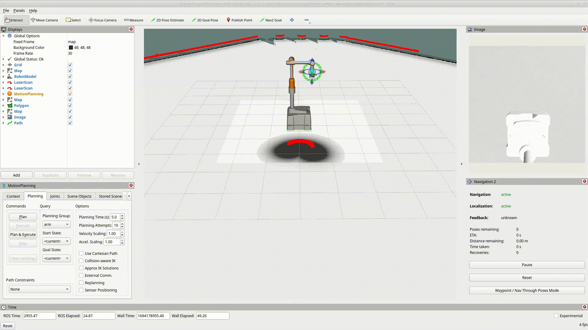

<a href="http://www.automationware.it/">
    
</a>

Authors: 
- [Mattia Dei Rossi](deirossi@automationware.it) - Innobotics
- [Alvin Matarozzo](matarozzo@automationware.it) - Innobotics
- [Armando Selvija](selvija@automationware.it) - Innobotics

# ComboFox Simulation

This workspace has been developed and tested on `ros2 humble`.


## Local setup and compile
Clone the repository:
```
https://github.com/InnoboticsSRL/one4all.git
```
Install necessary dependencies:
```
sudo apt-get update
sudo apt-get install -y ros-humble-xacro \
    ros-humble-gazebo-ros2-control \
    ros-humble-ros2-control \
    ros-humble-ros2-controllers \
    ros-humble-camera-ros \
    ros-humble-gazebo-plugins \
    ros-humble-moveit-ros-move-group \
    ros-humble-pilz-industrial-motion-planner \
    ros-humble-moveit \
    ros-humble-gazebo-ros ros-humble-gazebo-plugins ros-humble-gazebo-ros-pkgs \
    ros-humble-navigation2 ros-humble-nav2-* \
    ros-humble-slam-toolbox \
    ros-humble-teleop-twist-joy \
    ros-humble-teleop-twist-keyboard\

rosdep update \
    && rosdep install --from-paths ./ -i -y --rosdistro humble \
      --ignore-src
```
Build the project:
```
cd one4all/
colcon build --symlink-install
```
Source the project:
```
. install/setup.bash
```
Run the simulation, including:
- Gazebo
- RViz2
- ROS2 navigation stack
- Move-group
```
ros2 launch neo_simulation2 simulation.launch.py
```
Additionally, rqt may be used for a first interaction with the robot (config file could be also loaded inside the app by GUI):
```
rqt --perspective-file rqt_controllers_commands.perspective
```


## Docker
Build the docker image:
```
cd one4all/
docker build -t gazebo_ros2_control .
```
Enable GUI
```
sudo xhost local:docker
```
Run the demo:
```
sudo docker run -it --rm --name gazebo_ros2_control_demo --net host --env DISPLAY=:0.0 gazebo_ros2_control ros2 launch neo_simulation2 simulation.launch.py
```

**Please note**: 
- GUI may takes several minutes to load
- It is suggested to use docker to simulate without GUI

## Expected result
### Arm's Movement Through Move-Group
<p align="center">
    
</p>


### Base's Movement Through Nav2
<p align="center">
    
</p>

### Movements Through rqt
<p align="center">
    
</p>